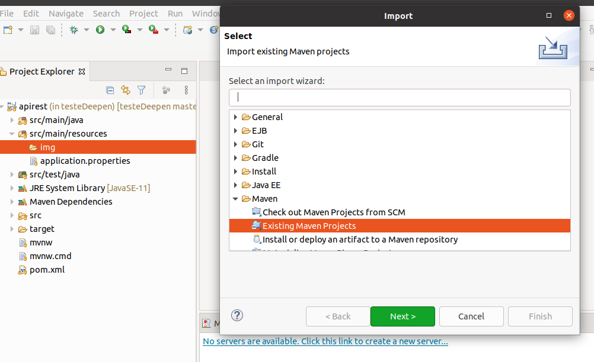

# testeDeepen

### DATABASE ###

Utilizando o **PostgreSQL**, criar uma DB de nome ```produtos_apirest```, um **usuário** de valor ```polako``` e um **password** de valor ```dev142021``` 

### GITHUB ###

Criar / selecionar um diretório para armazenar o arquivo do projeto e, então, utilizar o seguinte comando para clone do repositório:

``` git clone https://github.com/JeanMonteiroPLK/testeDeepen.git ```

### IDE - ECLIPSE ###

Dentro de um workspace, vá em **File** > **Import** > **Maven** > **Existing Maven Projects** > **Next**


Em **Browse...**, selecione o diretório onde foi arquivado o clone do projeto e **Next**. Com isso, a IDE deve fazer o download das dependências do projeto.

No **Project Explorer**, abra ```apirest``` > ```src/main/java``` > ```com.deepen.apirest``` e em ```Application.java```, clique com botão direito do mouse e selecione ```Run As``` > ```Java Application```


### QUALIDADE ##

**CLEAN CODE** 

```Objetivo``` 

Das refatorações pontuais feitas, o intuito foi de tornar o código mais simples, claro e objetivo sem perda de funcionalidade.

```Exemplo```

Nome de variáveis simplificadas; nomes dos métodos sem redundância; ordem intuitiva de parâmetros de determinados métodos;

**SINGLE RESPONSABILITY - S.O.L.I.D.**

```Objetivo```

Manter cada método de requisição HTTP (end-points) o mais específico possível.

```Exemplo```

No caso da validação do preço do produto, método específico para a regra de negócio e não uma estrutura condicional dentro do método de deleção, o que seria mais de uma atribuição a um mesmo comportamento.

**TESTES UNITÁRIOS**

```Objetivo```

Confirmar o funcionamento de trecho específico do código sem que houvesse a necessidade de subir a aplicação e testá-la via plataforma (Postman)

```Exemplo```

Teste unitário do método 'podeDeletar(preco)', certificando seu funcionamento

